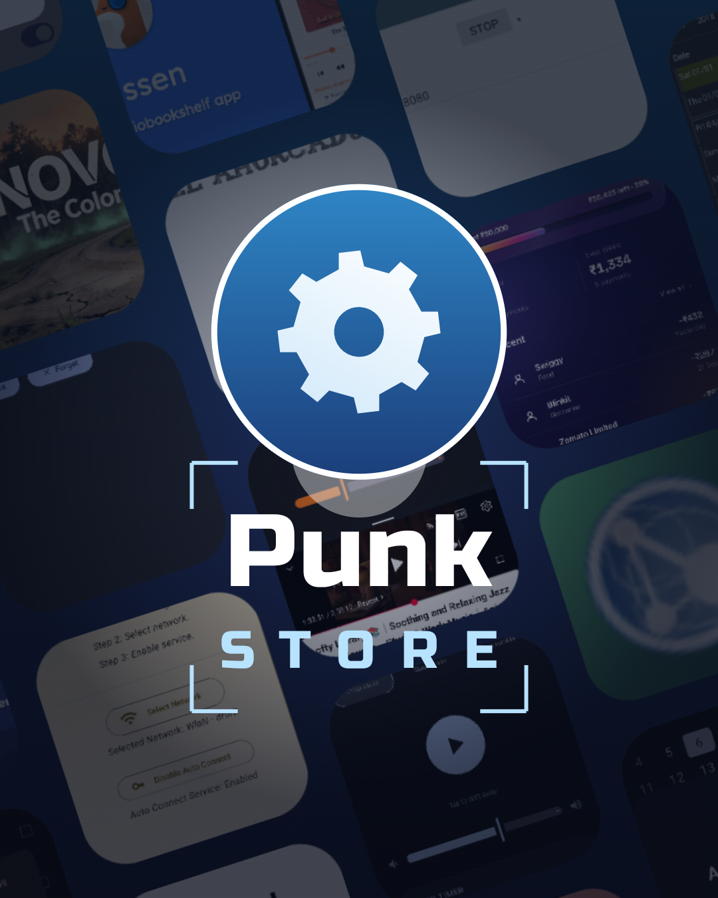
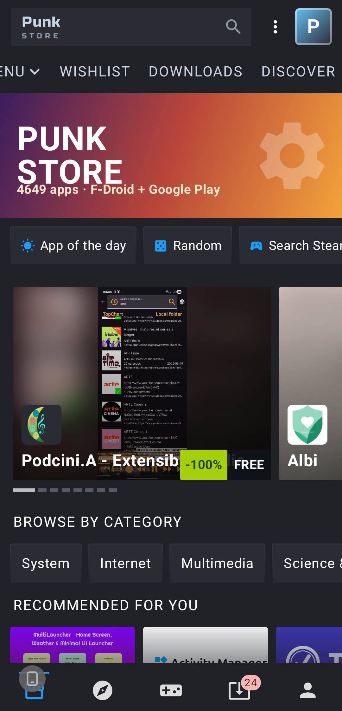
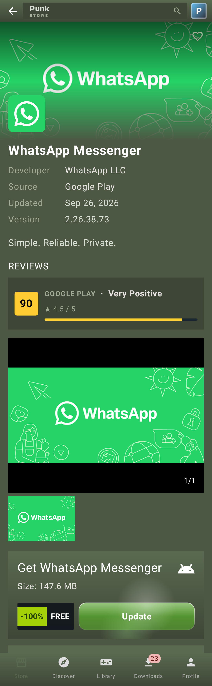
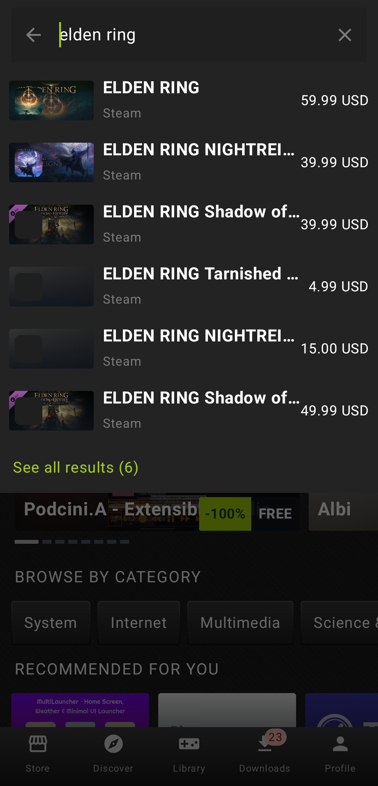
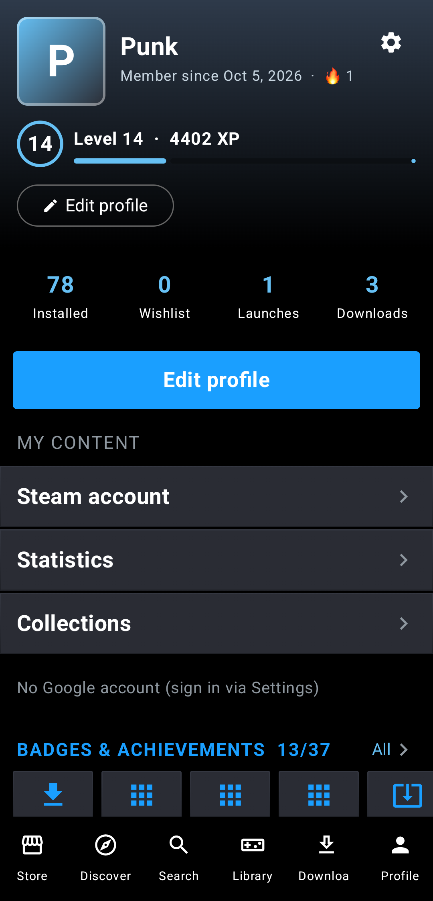

<p align="center"></p>

# Punk Store

I got tired of jumping between F-Droid, the Play Store and Steam every time I wanted to find something for my phone, so I made one store that has all three. It looks like the Steam mobile app, because I just like that interface.

It's a fan project I build for fun. It has nothing to do with Valve. Licensed under GPL-3.0.

## What's inside

**Three sources, one search.** Open source apps from F-Droid, Google Play (anonymous or with your own Google account, the same way Aurora Store does it) and the Steam store, all in one place. Search runs as you type, and the best match comes first.

**A library that works like Steam's.** The app you used last sits at the top on a big card, with your other recent ones under it. You can filter by installed, not installed or waiting for an update, collapse groups, and switch between grid and list. Long-press anything to open, update, pin, add to a collection or uninstall it. Apps you installed from somewhere else show up too.

**Your Steam account.** Sign in with Steam and your games, playtime and achievements come over, with the games in their own library filter. You sign in on Steam's own page, so your password never touches the app. If you'd rather not sign in, your profile name is enough, but then you only get the games shown on your profile, because Steam no longer shows the full list to signed-out visitors.

**Downloads.** Two apps download at once and the rest wait in a queue. You can pause anytime and pick up where you left off later. Even if your connection drops or the app gets closed, the download doesn't start over. If the network goes away it retries on its own a few times. Every file's size and SHA-256 hash are checked. The notification shows speed and time left, plus pause and cancel buttons.

**Installing.** Pick the regular Android installer, the system install screen, or silent installs with root. For split APKs from Play, only the parts that match your phone's CPU get downloaded.

**App pages.** Screenshots, user reviews from Play and Steam, and a privacy report (ads, trackers, with a link to Exodus). Steam games also show supported platforms, system requirements, SteamDB info and estimated sales.

**Small stuff.** Wishlist, collections, pinned apps, a Tinder-style Discover screen, levels and achievements, update notifications, backup and restore.

## Screenshots

<p align="center"></p>

<p align="center">
 
</p>
<p align="center">
 
</p>

## Themes

- **Steam (default):** the colors of the current Steam mobile app.
- **Steam 2013:** carbon black background with glossy green buttons.
- **Steam 2006:** the old olive green Steam with bevelled edges.
- **Material You:** your phone's own colors, if Steam isn't your thing.

## Languages

- English (default)
- Türkçe

## Building

Written in Kotlin with Jetpack Compose. Needs Android 8.0 (API 26) or newer.

```sh
gradle assembleRelease
```

The APK ends up in `app/build/outputs/apk/release/`.

## Where the data comes from

- **F-Droid:** the official repo's `index-v2.json`
- **Google Play:** Aurora OSS's [gplayapi](https://gitlab.com/AuroraOSS/gplayapi) library
- **Steam store:** Steam's public store endpoints (no API key needed)
- **Steam profile:** steamcommunity.com profile pages

## Thanks

This app wouldn't exist without [F-Droid](https://f-droid.org) and [Aurora Store](https://auroraoss.com). The logo font is Russo One (OFL).
